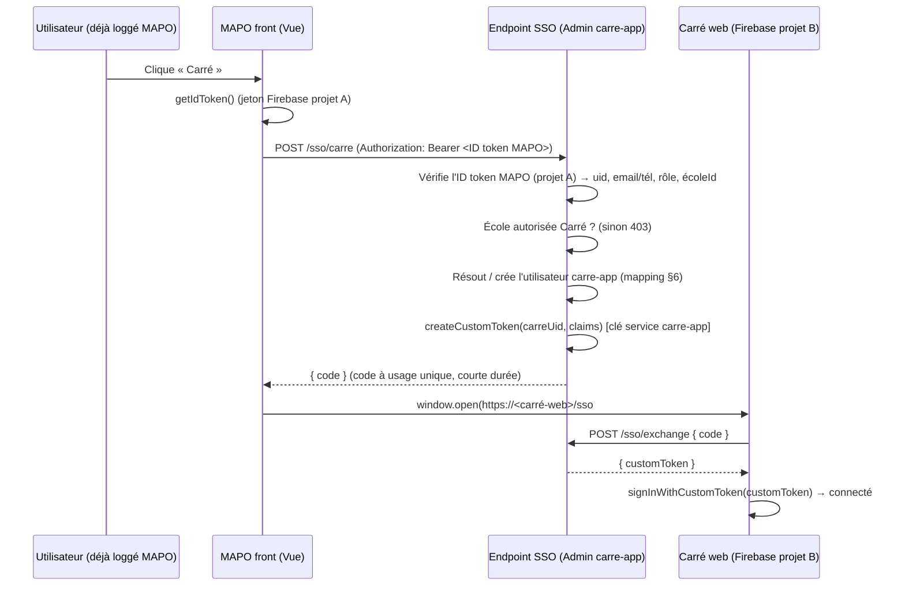

# Spécification — SSO MAPO / MIAPO+ → Carré

> Bouton « Carré » dans MAPO qui ouvre Carré **déjà connecté**, sans imposer d'installation ni d'achat.
> Cible immédiate : pont *custom token* Firebase. Cible long terme : « Se connecter avec EDUFREM ».
> Statut : spécification de cadrage (P2) · EDUFREM · à passer au développeur de Carré.

---

## 1. Objectif & principes

- Un utilisateur connecté à **MAPO** (ou **MIAPO+**) clique sur un bouton **« Carré »** dans le menu → il arrive dans Carré **déjà authentifié**, sans ressaisir d'identifiants.
- **Ne force personne à installer ou acheter Carré** : le bouton ouvre la **version web légère** de Carré (dans le navigateur). Les utilisateurs qui ont l'app Electron gardent le desktop (voir §9).
- **Marche quel que soit le mode de connexion MAPO** — téléphone **ou** email. C'est le point non négociable : une grande partie des utilisateurs MAPO se connectent **par numéro de téléphone, sans email**. Un simple « SSO Google » les exclurait → **écarté**.
- **Opt-in par école** : l'accès Carré est activable/désactivable par EDUFREM, école par école (sert aussi de base au modèle commercial, §8).

---

## 2. Contexte technique (existant)

| Produit | Stack | Auth | Notes |
|---|---|---|---|
| MAPO / MIAPO+ | Vue 3 + Vite + Firebase, PWA | **Firebase Auth projet A** (login téléphone **ou** email) | Déjà des proxys serveur sur cPanel : `mapo-ia.php`, `mapo-notify.php`, `mapo-pay.php`, `mapo-provision.php` |
| Carré | Electron (desktop) + **site web + version web légère en cours** | **Firebase Auth projet B** (`carre-app`) | MCP existant (prise de notes) |

➡️ **Deux projets Firebase distincts** : il n'y a pas d'identité partagée « gratuite ». Il faut un **pont** qui traduit une session MAPO (projet A) en session Carré (projet B).

---

## 3. Architecture retenue (maintenant) : pont *custom token* MAPO → Carré

MAPO est la **source de session** (c'est là qu'on est déjà connecté). Un **endpoint sécurisé**, détenteur des droits Admin de `carre-app`, échange une preuve d'identité MAPO contre un **jeton personnalisé** (custom token) Carré.

**Pourquoi custom token et pas « SSO Google »** : le custom token fonctionne **indépendamment de la façon dont l'utilisateur s'est connecté à MAPO** (téléphone, email, plus tard SSO EDUFREM). Google SSO ne marcherait que pour la fraction d'utilisateurs disposant d'un compte Google, et casse le principe « même compte que MAPO » quand l'identifiant MAPO est un numéro.

---

## 4. Flux détaillé

1. L'utilisateur, **connecté à MAPO**, clique sur **« Carré »** (menu Scolarité).
2. Le front MAPO récupère l'**ID token Firebase** courant : `auth.currentUser.getIdToken()`.
3. Le front appelle **`POST /sso/carre`** avec l'ID token en en-tête `Authorization: Bearer …`.
4. L'endpoint **vérifie l'ID token MAPO** (projet A) côté serveur → récupère `uid`, `email`/`phone_number`, et les claims utiles (`role`, `schoolId`).
5. L'endpoint vérifie que **l'école a Carré activé** (sinon `403`).
6. L'endpoint **résout l'identité Carré** : recherche un utilisateur `carre-app` lié, sinon **le crée** (provisioning à la volée) — voir mapping §6.
7. L'endpoint **émet un custom token** `carre-app` : `admin.auth().createCustomToken(carreUid, { source: 'mapo', role, schoolId })`.
8. **Transport recommandé (sécurisé)** : l'endpoint renvoie un **code à usage unique** (courte durée, ~60 s). Le front ouvre `https://<carré-web>/sso#code=…`. La web-app Carré **échange** ce code contre le custom token via `POST /sso/exchange`. *(Variante minimale : renvoyer directement le customToken dans le fragment `#token=…` — acceptable en MVP mais moins sûr, cf. §7.)*
9. Carré web appelle **`signInWithCustomToken(customToken)`** → l'utilisateur est **connecté**, avec ses infos préremplies.

---

## 5. Contrat de l'endpoint (API)

**`POST /sso/carre`**
- En-tête : `Authorization: Bearer <ID token Firebase MAPO>`
- Réponse `200` : `{ "code": "<one-time-code>", "expiresIn": 60 }`
- Erreurs : `401` (ID token MAPO invalide/expiré) · `403` (école sans accès Carré) · `500`.

**`POST /sso/exchange`** *(appelé par Carré web)*
- Corps : `{ "code": "<one-time-code>" }`
- Réponse `200` : `{ "customToken": "<carre custom token>" }` (code invalidé après usage)
- Erreurs : `400/401` (code inconnu/expiré/déjà utilisé).

CORS restreint aux domaines MAPO/MIAPO+ (émission) et Carré web (échange). HTTPS obligatoire.

---

## 6. Mapping d'identité MAPO ↔ Carré

- **Clé de correspondance** (dans l'ordre) : `email` si présent → sinon **téléphone normalisé E.164** → sinon un identifiant dérivé `mapo_{uidMAPO}`.
- **Stockage du lien** : collection `carre-app` `sso_links/{mapoUid}` = `{ carreUid, key, createdAt }` (idempotent, un seul compte Carré par utilisateur MAPO).
- **Provisioning à la volée** : au premier SSO, créer l'utilisateur `carre-app` (via Admin SDK) avec les infos MAPO (nom, prénom, école) pour préremplir Carré.
- **Custom claims Carré** : propager `role` et `schoolId` → Carré peut adapter l'expérience et rattacher les notes à l'école (utile pour la boucle Carré → MIAPO+).

---

## 7. Sécurité

- **Vérification serveur obligatoire** : ne jamais faire confiance au front. L'endpoint vérifie l'ID token MAPO (signature RS256 + `aud` = projet A + `exp`).
- **Clé de service `carre-app`** = **secret serveur** (comme `mapo-ia-config.php`), jamais côté client, jamais dans le dépôt. → **posée par Steve** au déploiement.
- **Jeton jamais en clair dans une URL en query** (`?token=` fuit via historique/referrer). Préférer le **code à usage unique** (§4.8) ; à défaut, fragment `#` + durée très courte.
- **Custom token de courte durée** ; le code à usage unique est **à usage unique** et expire ~60 s.
- **Révocation** : le lien `sso_links` permet de couper l'accès d'un utilisateur ; le `403` par école coupe l'accès au niveau établissement.
- **Minimisation** : ne transmettre que les claims nécessaires (RGPD / données élèves).

---

## 8. Produit & commercialisation (metering)

L'endpoint SSO est le **point de contrôle** idéal :
- Il **refuse (`403`)** si l'école n'a pas Carré activé → gère l'opt-in et le « ne pas forcer ».
- Il **compte l'usage par compte** (nombre d'ouvertures, d'utilisateurs actifs) → pose les bases du **modèle freemium** (gratuit jusqu'à un seuil, payant au-delà), cohérent avec le modèle « à la Claude » visé.

---

## 9. Version desktop (Electron) — plus tard

- **MVP** : le bouton ouvre la **web-app** Carré (marche partout, zéro installation).
- **Évolution** : deep link `carre://sso?code=…` capté par l'app Electron → même `POST /sso/exchange` → `signInWithCustomToken`. Le front MAPO peut tenter le deep link puis retomber sur le web si l'app n'est pas installée.

---

## 10. Intégration côté MAPO

- **Bouton** : `src/components/layout/AppSidebar.vue`, `STAFF_NAV_ITEMS`, groupe `scolarite` (icône dédiée, ex. `NotebookPen`). Clé i18n `nav.carre` (FR/EN, parité). *(À décider : visible pour tout le staff ou enseignants seulement.)*
- **Service front** : `src/services/carreSso.js` → `getIdToken()` → `fetch('<endpoint>/sso/carre')` → `window.open(carreWebUrl + '#code=' + code, '_blank')`. Gérer l'état de chargement + erreurs (`403` = « Carré n'est pas activé pour votre école »).
- **Aucune route MAPO** ajoutée : le bouton ouvre un onglet externe.

---

## 11. Où héberger l'endpoint

Deux options, au choix du développeur Carré :

| Option | Pour | Contre |
|---|---|---|
| **Cloud Function (Node, projet `carre-app`)** *(recommandé)* | `verifyIdToken` + `createCustomToken` en une ligne via `firebase-admin` ; l'endpoint vit **avec** Carré (qui détient déjà le projet B) | Introduit GCP Functions |
| **Proxy PHP sur cPanel** (`mapo-carre-sso.php`) | Cohérent avec les proxys MAPO existants | Signer un custom token en PHP demande `kreait/firebase-php` (ou signer le JWT RS256 à la main) + vérifier l'ID token MAPO (JWKS Google) |

**Recommandation** : Cloud Function côté `carre-app` (l'endpoint mint des jetons Carré, il est logique qu'il vive dans le projet Carré et soit maintenu par l'équipe Carré). Le proxy PHP reste possible si l'on veut tout garder sur cPanel.

---

## 12. Cible long terme — « Se connecter avec EDUFREM »

Le pont d'aujourd'hui est une **brique**, pas un cul-de-sac :

- Désigner un **fournisseur d'identité EDUFREM central** (Google Cloud **Identity Platform**, ou un projet Firebase dédié `edufrem-id` agissant en OIDC).
- **MAPO, MIAPO+, Carré, NOVA** deviennent des *relying parties* : un **seul compte EDUFREM** ouvre tous les produits (SSO natif).
- Les liens `sso_links` posés maintenant se **migrent** en identités centrales — le mapping n'est pas perdu.
- L'IdP central devient le **point de comptage unifié** du modèle commercial (un compte, une facturation à l'usage sur tout l'écosystème).

---

## 13. Décisions à confirmer (Steve / dév Carré)

1. **URL de la web-app Carré** (cible du bouton).
2. **Endpoint** : Cloud Function (recommandé) ou proxy PHP cPanel ?
3. **Clé de correspondance** identité : email → téléphone → `mapo_{uid}` (validé ?).
4. **Transport du jeton** : code à usage unique (recommandé) ou fragment `#token`.
5. **Visibilité du bouton** : tout le staff, ou enseignants uniquement ?
6. **Activation Carré par école** : où la stocker (doc `schools/{id}.modulesActifs` côté MAPO + vérif dans l'endpoint) ?

---

## 14. Lot de livraison — MVP

- [ ] **Carré web** : route `/sso` qui lit le code, appelle `/sso/exchange`, puis `signInWithCustomToken`.
- [ ] **Endpoint** `carreSso` : vérif ID token MAPO + contrôle école + mapping/provisioning + `createCustomToken` + code à usage unique.
- [ ] **Config secrète** : service account `carre-app` posé côté serveur (**action Steve**).
- [ ] **MAPO** : bouton « Carré » (AppSidebar) + `carreSso.js` + i18n `nav.carre` (FR/EN).
- [ ] **Activation par école** (opt-in) + réponse `403` gérée dans l'UI.
- [ ] **Test bout-en-bout** : login MAPO **par téléphone** → clic « Carré » → Carré web connecté, notes rattachées à l'école.

---

*Rédigé pour EDUFREM. Périmètre : intégration d'authentification MAPO ↔ Carré. Ne couvre pas le produit Carré lui-même ni la boucle pédagogique Carré → MIAPO+ (spécification séparée).*
